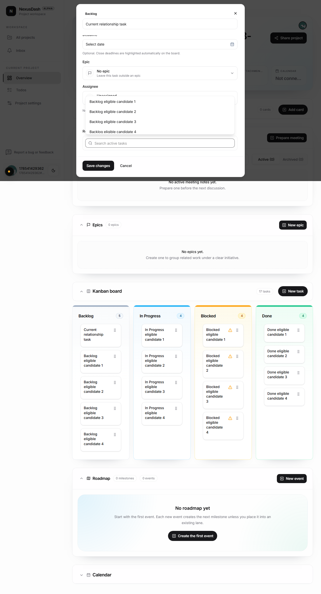
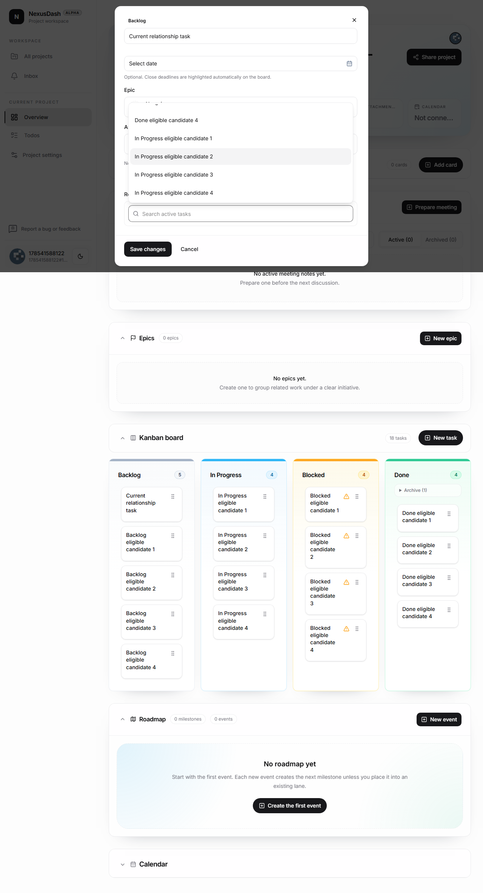
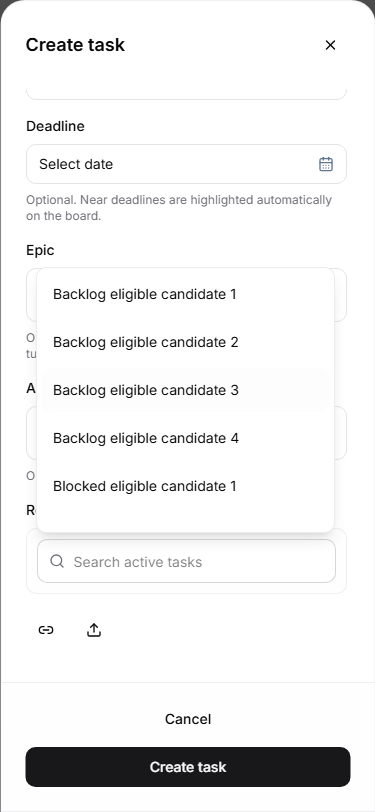

# TASK-350: Complete related-task candidate list

## Status

- Done (2026-07-30, merged via PR #400)
- GitHub issue: [#396](https://github.com/dorianagaesse/nexus_dash/issues/396)
- Pull request: [#400](https://github.com/dorianagaesse/nexus_dash/pull/400)
- Branch: `fix/task-350-related-task-picker`

## Objective

Make every eligible active task in the authorized current project searchable,
reachable, and selectable from the create-task and task-detail `Related to`
pickers, regardless of Kanban status.

## Problem

The picker currently omits or hides otherwise valid relationship candidates.
The cause may be incomplete status aggregation, filtering, clipped overflow, or
a combination. In particular, Blocked tasks and tasks below the visible fold
must remain available.

## Investigation

- Trace `allTasks` into `components/kanban/related-task-field.tsx` from both
  create and detail flows.
- Record the unfiltered and eligible candidate counts for Backlog, In Progress,
  Blocked, and Done before changing behavior.
- Verify archived, cross-project, unauthorized, current, selected, and
  already-related rules independently.
- Inspect overlay height, overflow ownership, wheel/touch containment, active
  option management, and focus visibility.
- Confirm search runs against the complete eligible set before rendering.

## In Scope

- Candidate construction for create-task and task-detail relationship fields.
- Status, archived-state, current-task, selected-task, and already-related
  filtering.
- Bounded list height, vertical scrolling, keyboard navigation, and focus
  visibility.
- Empty and no-results states.
- Focused regression coverage with an overflowing result set.

## Out Of Scope

- Bilateral relationship semantics (TASK-349 / issue #395).
- Candidate-row redesign (TASK-352).
- User-facing task identifiers (TASK-351).
- Blocked follow-up behavior.
- Cross-project or unauthorized task discovery.

## Runtime Assumptions

- Node dependencies and Playwright Chromium are installed.
- Docker-backed PostgreSQL can be started for authenticated browser validation.
- Preview validation, if needed, will explicitly target
  `fix/task-350-related-task-picker`.

## Acceptance Criteria

1. Backlog, In Progress, Blocked, and Done tasks are included under the same
   active-task eligibility rules in both picker entry points.
2. The current task is excluded while selected/already-related behavior stays
   intentional and reversible.
3. Archived, cross-project, and unauthorized tasks are unavailable.
4. Search evaluates the full eligible collection, including candidates below
   the fold.
5. Overflowing results use a contained vertical scroll area that does not move
   the underlying modal/page.
6. Keyboard users can reach the first through final filtered option and the
   active option remains visible.
7. Empty project and no-match states communicate different outcomes.
8. Component tests and Playwright coverage exercise an overflowing mixed-status
   set at desktop and narrow viewport sizes.
9. Before/after status counts and screenshots or recordings are recorded in
   task context.

## Definition Of Done

- Root cause and candidate counts are documented.
- Shared picker behavior is implemented without broadening authorization.
- Focused tests and repository validation gates pass.
- Product version, current task, backlog status, and journal are updated.
- Reviewable changes are committed, pushed, and opened in a ready PR.

## Visual Evidence

### Before: capped candidate prefix

### After: final eligible candidate reached

### After: contained 375 px create flow

